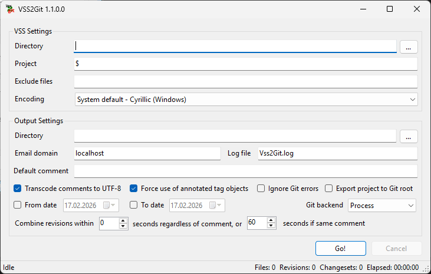

# Vss2Git

> **Actively maintained fork** of the [original vss2git](https://github.com/trevorr/vss2git) by Trevor Robinson (abandoned since 2016). This fork has been substantially reworked with 94+ commits — the core migration engine was refactored into a shared library, two new high-performance git backends were added, and dozens of correctness bugs were fixed. Always inspect the resulting Git repository before relying on it.

## What's new in this fork

### Architecture & platform
- **Targets .NET 8.0** (upgraded from .NET Framework 4.5.2)
- **Core library extracted** (`Vss2Git.Core`) — the migration engine is no longer coupled to WinForms, enabling the CLI and future integrations
- **Windows installer** (`Vss2GitSetup.exe`) — GUI/CLI component selection, .NET 8 runtime detection, per-user install (no admin required)

### New features
- **Command-line interface** (`Vss2Git.Cli`) for scripted/unattended migrations
- **Three git backends** with identical output:
  - `Process` (default) — spawns git.exe per command
  - `LibGit2Sharp` — managed library, ~6x faster
  - `FastImport` — streaming via `git fast-import`, ~19x faster
- **Date range migration** (`--from-date`, `--to-date`) for incremental/chunked exports
- **Built-in directory verification** (`Vss2Git.Cli verify`) to compare migration results against VSS working copies
- **VSS database repair tool** (`vss_analyze.cmd`) — automated diagnostic scan and multi-pass repair
- **Performance instrumentation** (`--perf` flag) and VssItem caching for faster VSS reads

### Bug fixes
- **Project move corruption** — MoveFrom/MoveTo ordering caused source path corruption
- **Stale files after move** — destination not cleaned up, leaving orphaned files in git
- **Timestamp collision ordering** — same-second revisions now use causal priority (create before edit before delete)
- **Directory deletion** — `git rm -rf` for projects with staged files
- **Comment deduplication** — exact line matching replaces broken substring check; whitespace handling fixed
- **Changeset false conflicts** — incorrect conflict detection between unrelated file actions
- **Case-only renames** — proper two-step `git mv` workaround
- **Shared file branching** — validation when removing shared project references
- **Shell metacharacter quoting** — added missing characters (`!`, `'`, `` ` ``) to git argument escaping
- **LibGit2Sharp fixes** — recursive remove on uncommitted subtrees, directory move, commit degradation, non-UTF-8 encoding skip
- **Logger file handle leak** — fixed on early exit from migration pipeline
- And many more (see commit history for the full list)

### Testing
- **251 automated tests** — unit tests (including cross-backend common tests), CLI tests, 13 integration scenarios with pre-built VSS databases, and cross-backend validation ensuring all 3 backends produce identical output

## What is it?

Vss2Git exports [Visual SourceSafe 6.0](https://en.wikipedia.org/wiki/Visual_SourceSafe) repositories to [Git](https://git-scm.com/), constructing meaningful commits by chronologically grouping individual file revisions into changesets.

Components:

  * **Vss2Git** — Windows GUI for interactive migration
  * **Vss2Git.Cli** — Command-line interface for scripted migration
  * **Vss2Git.Core** — Shared migration engine (RevisionAnalyzer, ChangesetBuilder, GitExporter)
  * **VssLogicalLib / VssPhysicalLib / HashLib** — Low-level VSS database reading libraries
  * **VssDump** — Diagnostic tool for inspecting VSS repositories

All components are written in C# targeting .NET 8.0.

## Installation

**Windows Installer:** Download `Vss2GitSetup-x.x.x.exe` from the [Releases](https://github.com/dimitar-grigorov/vss2git/releases) page. Choose to install GUI, CLI, or both. Requires [.NET 8.0 Desktop Runtime](https://dotnet.microsoft.com/download/dotnet/8.0).

**Portable ZIP:** Extract and run directly. Requires [.NET 8.0 Desktop Runtime](https://dotnet.microsoft.com/download/dotnet/8.0) (for GUI) or .NET 8.0 Runtime (for CLI only), and Git in PATH (for Process backend).

## Building

**Prerequisites:** [.NET 8.0 SDK](https://dotnet.microsoft.com/download/dotnet/8.0)

```bash
dotnet build Vss2Git.sln --configuration Debug
dotnet test Vss2Git.sln --configuration Debug
```

## Usage

### GUI

Run `Vss2Git.exe`, configure the VSS database path and Git output directory, then click Start.

### CLI

```bash
# Basic migration
Vss2Git.Cli --vss-dir "C:\VSS\MyProject" --git-dir "C:\Git\MyProject" --email-domain "company.com"

# Fast migration with FastImport backend
Vss2Git.Cli --vss-dir "C:\VSS\MyProject" --git-dir "C:\Git\MyProject" --git-backend FastImport --ignore-errors

# Incremental migration with date ranges
Vss2Git.Cli --vss-dir "C:\VSS\MyProject" --git-dir "C:\Git\MyProject" --to-date 2005-01-01
Vss2Git.Cli --vss-dir "C:\VSS\MyProject" --git-dir "C:\Git\MyProject" --from-date 2005-01-01

# Migrate a subproject with encoding and exclusions
Vss2Git.Cli --vss-dir "C:\VSS\MyProject" --git-dir "C:\Git\MyProject" \
  --vss-project "$/SubFolder" --exclude "*.exe;*.dll" --encoding 1252
```

Key options: `--git-backend` (Process/LibGit2Sharp/FastImport), `--from-date`/`--to-date`, `--vss-project`, `--exclude`, `--ignore-errors`, `--perf`. Run `Vss2Git.Cli --help` for all options.

## Goals

  * **Preserve as much history as possible** — replays the VSS database from the beginning, including deleted and renamed files. Only destroyed or archived-but-not-restored history is lost.
  * **Meaningful changesets** — scans all revisions, sorts chronologically, and groups them into commits. The result looks as if the project was maintained in Git from the start.
  * **Robustness** — handles common VSS database inconsistencies so migration can proceed unattended. Serious errors present Abort/Retry/Ignore options.
  * **Speed** — a 19K-file VSS database (148K revisions) migrates in ~21s (FastImport), ~1min (LibGit2Sharp), or ~7min (Process).

## Usage tips

  * Run on a **local backup copy** of your VSS database — faster and safer than a network share.
  * **Antivirus software** (especially Windows Defender) can cause `"fatal: Unable to write new index file"` errors. Exclude the Git output path from real-time scanning.
  * The Git output directory should be **empty or non-existent**. Delete everything including `.git` when re-running.
  * Migration starts at any VSS project path (e.g. `$/ProjectA/Subproject1`) and includes all subprojects.
  * Exclude patterns use semicolons and wildcards: `?` (single char), `*` (within directory), `**` (recursive).
  * VSS features without Git equivalents: branched/shared files become copies, empty directories are not tracked, VSS labels become Git tags (global scope).
  * Corrupt VSS databases with CRC errors must be repaired first with `Analyze.exe -f` or `vss_analyze.cmd`. Always back up before running it.

## Known issues

  * Git must be in PATH (not required for LibGit2Sharp/FastImport backends).
  * Only one VSS project path per run. Disjoint subtrees need separate runs (commits won't interleave).
  * Email addresses are auto-generated from VSS usernames (e.g. "John Doe" becomes `john.doe@localhost`). Customize via `--email-domain` or edit `GitExporter.GetEmail()`.

## Extra Tools

| Tool | Description |
|------|-------------|
| `Vss2Git.Cli verify -s <source> -t <target> -x ".vs;.git"` | Compare a VSS working directory against Git output — reports missing and extra files |
| `compare-dirs.cmd <source> <target>` | Standalone batch script for the same comparison (no CLI required) |
| `vss_analyze.cmd <vss-database>` | Automated `Analyze.exe` wrapper — diagnostic scan, multi-pass repair, verification (requires admin + VSS tools) |

## Testing

```bash
dotnet test Vss2Git.sln --configuration Debug
```

251 tests across 3 suites: unit tests (cross-backend common + backend-specific), CLI option mapping tests, and integration tests using pre-built VSS databases. See [Vss2Git.IntegrationTests/README.md](Vss2Git.IntegrationTests/README.md) for details.

> **Note:** Integration tests that build VSS test databases require `ss.exe` and `mkss.exe` from [Microsoft Visual SourceSafe](https://archive.org/details/X08-65726) installed at `C:\Program Files (x86)\Microsoft Visual SourceSafe\`. These tests are skipped automatically when the tools are not present.

## Screenshot



## Support

Report bugs and feature requests at [GitHub Issues](https://github.com/dimitar-grigorov/vss2git/issues).

## License

Vss2Git is open-source software, licensed under the [Apache License, Version 2.0](License.md). **Any use of the software is at your own risk.** Always back up your VSS database before using this tool.
