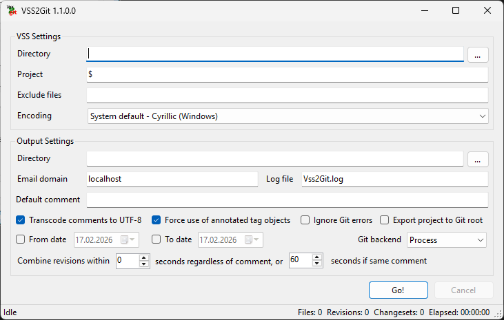

# Vss2Git

[](https://github.com/dimitar-grigorov/vss2git/releases/latest)
[](https://dotnet.microsoft.com/download/dotnet/10.0)
[](LICENSE.txt)

Vss2Git exports a [Visual SourceSafe 6.0](https://en.wikipedia.org/wiki/Visual_SourceSafe) database to [Git](https://git-scm.com/). Instead of dumping the latest version of every file, it replays the whole VSS history from the beginning and rebuilds it as a series of Git commits — so the resulting repository looks as though the project had been kept in Git all along, with renames, moves, deletes and labels intact.

> This is an actively maintained fork of the [original vss2git](https://github.com/trevorr/vss2git) by Trevor Robinson, which was abandoned around 2016. The migration engine has been pulled out into a reusable library, two new (much faster) Git backends were added, a command-line interface was written, and a long list of history-reproduction bugs were fixed. As with any history rewrite, **inspect the resulting repository before you trust it.**



## What's new in this fork

The [original vss2git](https://github.com/trevorr/vss2git) stopped at .NET Framework 4.5.2 with a single, slow Git backend. This fork is a substantial rework — over 100 commits of new features, two much faster backends, and a long list of correctness fixes.

### Platform
- **Targets .NET 10.0** (up from .NET Framework 4.5.2).
- **Migration engine extracted** into `Vss2Git.Core`, decoupled from WinForms so the CLI — and anything else — can drive it.
- **Windows installer** (`Vss2GitSetup.exe`) with GUI/CLI component selection and a per-user install that needs no admin rights.

### New features
- **Command-line interface** for scripted, unattended migrations.
- **Two extra Git backends** — `LibGit2Sharp` (~6× faster) and `FastImport` (~19× faster) — producing output identical to the original `Process` backend.
- **Date-range migration** (`--from-date` / `--to-date`) for incremental or chunked exports.
- **Database browsing** (`Vss2Git.Cli list`) — print a project's tree, list files, or find shared files before migrating.
- **Built-in verification** (`Vss2Git.Cli verify`) to diff a migration against a VSS working copy.
- **Database repair helper** (`vss_analyze.cmd`) wrapping `Analyze.exe` for diagnostic scans and multi-pass repair.
- **Performance instrumentation** (`--perf`) and VssItem caching for faster reads.

### Bug fixes
- **Project move corruption** — MoveFrom/MoveTo ordering corrupted the source path.
- **Stale files after a move** — the destination wasn't cleaned up, leaving orphaned files in Git.
- **Ghost files after rename collisions** — and a false "Destroyed" flag during project moves.
- **Timestamp collisions** — same-second revisions now apply in causal order (create before edit before delete).
- **Directory deletion** — projects with staged files are removed correctly.
- **Comment deduplication** — exact line matching instead of a broken substring check.
- **False changeset conflicts** — between unrelated file actions.
- **Case-only renames** — handled with the proper two-step `git mv`.
- **Shared-file branching** — validated when removing shared project references.
- **Shell metacharacter quoting** — added the missing characters to Git argument escaping.
- **LibGit2Sharp** — recursive removes on uncommitted subtrees, directory moves, commit degradation, non-UTF-8 handling.
- **Archive/restore actions** — archive removes files/projects, restore re-adds them, version-only archive is a no-op.
- **CLI exit code** — returns non-zero on migration errors instead of always succeeding.
- **Logger file-handle leak** — fixed on early exit from the pipeline.

See the [commit history](https://github.com/dimitar-grigorov/vss2git/commits/master) for the full list.

## What you get

| Component | What it is |
|-----------|------------|
| **Vss2Git** | WinForms GUI for interactive migration |
| **Vss2Git.Cli** | Command-line tool for scripted / unattended migration |
| **Vss2Git.Core** | The migration engine (revision analysis, changeset building, Git export) |
| **VssLogicalLib / VssPhysicalLib / HashLib** | Libraries that read the raw VSS database format |
| **VssDump** | Diagnostic tool for inspecting a VSS database |

The applications and tests target **.NET 10.0**; the three VSS-reading libraries target **.NET Standard 2.0**.

## Installation

**Installer** — download `Vss2GitSetup-x.x.x.exe` from the [Releases](https://github.com/dimitar-grigorov/vss2git/releases) page and pick the GUI, the CLI, or both. It's a per-user install (no admin rights needed) and will point you at the runtime download if it's missing.

**Portable ZIP** — extract and run. The GUI needs the [.NET 10.0 Desktop Runtime](https://dotnet.microsoft.com/download/dotnet/10.0); the CLI needs the [.NET 10.0 Runtime](https://dotnet.microsoft.com/download/dotnet/10.0). Git must be on `PATH` for the default backend (not required for the other two).

## Usage

### GUI

Run `Vss2Git.exe`, set the VSS database path and the Git output directory, and click Start.

### CLI

The CLI has three verbs; if you don't name one, `migrate` is assumed.

- **`migrate`** — run a VSS-to-Git migration
- **`list`** — list a database's projects, files, or shared files; handy for exploring before you migrate
- **`verify`** — compare a VSS working copy against the Git output and report what's missing or extra

```powershell
# Basic migration
Vss2Git.Cli --vss-dir "C:\VSS\MyProject" --git-dir "C:\Git\MyProject" --email-domain "company.com"

# Fast migration with the FastImport backend
Vss2Git.Cli --vss-dir "C:\VSS\MyProject" --git-dir "C:\Git\MyProject" --git-backend FastImport --ignore-errors

# Migrate a subproject, with an encoding and exclusions
Vss2Git.Cli --vss-dir "C:\VSS\MyProject" --git-dir "C:\Git\MyProject" `
  --vss-project "$/SubFolder" --exclude "*.exe;*.dll" --encoding 1251

# Look around before migrating
Vss2Git.Cli list --vss-dir "C:\VSS\MyProject" --type all
Vss2Git.Cli list --vss-dir "C:\VSS\MyProject" --shared      # shared files, grouped by physical file

# Compare results afterwards
Vss2Git.Cli verify -s "C:\VSS\WorkingDir" -t "C:\Git\MyProject" -x ".vs;.git"
```

See **[Vss2Git.Cli/README.md](Vss2Git.Cli/README.md)** for the full per-command option reference and example output. The CLI returns `0` on success, `1` for bad arguments or a startup error, and `2` if the migration finished but hit errors.

## How it works

A migration runs through three stages, wired together by `MigrationOrchestrator`:

1. **RevisionAnalyzer** walks the VSS database from the chosen project, reading every revision of every file and subproject — including ones that were later deleted or renamed. Shared files are read once; destroyed files are tracked so they can be skipped correctly.

2. **ChangesetBuilder** sorts all those revisions chronologically and groups them into commits. VSS records one revision per file, so a single logical change ("checked in 10 files with the same comment") shows up as ten separate revisions seconds apart. The builder stitches them back together using time-and-comment heuristics (`--any-comment-threshold` / `--same-comment-threshold`), one pending changeset per user, flushing when a file would collide with itself.

3. **GitExporter** replays the changesets into a Git repository. It keeps a live model of where every item lives (`VssPathMapper`) so it can translate VSS actions — add, edit, rename, move, share, branch, pin, delete, destroy, label — into the right Git operations, including the awkward cases like case-only renames and files shared across several projects. VSS labels become Git tags.

### Git backends

All three backends produce identical output (same commits, tags, and byte-for-byte file content — checked by cross-backend tests and real migrations). Pick one with `--git-backend`:

| Backend | How it works | 19K files / 148K revisions |
|---------|--------------|----------------------------|
| `Process` (default) | Runs `git.exe` once per operation | ~7 min |
| `LibGit2Sharp` | Managed Git library, builds trees in memory | ~1 min (≈6× faster) |
| `FastImport` | Streams a single `git fast-import` process | ~21 s (≈19× faster) |

`FastImport` also supports continuing an existing repository, which is what makes date-range migration (`--from-date` / `--to-date`) useful for chunked or incremental exports.

## Goals

- **Keep as much history as possible.** The database is replayed from the start, including deleted and renamed files. The only things that can't come across are history that VSS itself destroyed, or archived history that was never restored.
- **Make commits that mean something.** Revisions are grouped into changesets rather than dumped one-per-commit.
- **Survive messy databases.** Common VSS inconsistencies are handled so a migration can run unattended; genuinely serious problems stop with Abort/Retry/Ignore.
- **Be fast.** See the backend table above.

## Tips

- Run against a **local copy** of the database, not a live network share — it's faster and safer.
- **Antivirus** (Windows Defender especially) can cause `fatal: Unable to write new index file`. Exclude the Git output folder from real-time scanning.
- The Git output directory should be **empty or non-existent**. When re-running, delete everything including `.git`.
- A migration can start at any project path (e.g. `$/ProjectA/Subproject1`) and includes everything beneath it.
- Exclude patterns use semicolons and wildcards: `?` (one character), `*` (within a directory), `**` (recursive).
- A corrupt database with CRC errors has to be repaired first with `Analyze.exe -f` (or `vss_analyze.cmd`). Back it up before you do.

## Known issues and limitations

- Git must be on `PATH` for the `Process` backend (not for `LibGit2Sharp` or `FastImport`).
- **One project path per run.** Disjoint subtrees need separate runs, and their commits won't interleave.
- **Emails are generated** from VSS usernames (`John Doe` → `john.doe@localhost`). Set the domain with `--email-domain`.
- **Some VSS features have no Git equivalent.** Branched and shared files become independent copies, empty directories aren't tracked, and labels become globally-scoped tags.
- **Pinned shared files.** A file's version is tracked per file rather than per project, so if the same file is pinned to one version in project A and edited in project B, the pinned copy can get the wrong content. Rare in practice, but worth knowing.
- **Cloaked directories look like "extra" files** when comparing. VSS lets each user cloak (hide) projects in their own `ss.ini`; cloaked items are still active in the database. Vss2Git reads the physical files and migrates everything regardless of cloaking — which is correct. If a comparison shows unexpected extra files, check `<database>\users\<username>\ss.ini` for `Cloak = Yes` before assuming a bug.

## Extra tools

| Tool | What it does |
|------|--------------|
| `Vss2Git.Cli verify -s <source> -t <target> -x ".vs;.git"` | Compare a VSS working copy against the Git output |
| `compare-dirs.cmd <source> <target>` | The same comparison as a standalone batch script (no CLI needed) |
| `vss_analyze.cmd <database>` | Wrapper around `Analyze.exe` — diagnostic scan, multi-pass repair, verification (needs admin + the VSS tools) |

## Building

You'll need the [.NET 10.0 SDK](https://dotnet.microsoft.com/download/dotnet/10.0).

```powershell
dotnet build Vss2Git.sln --configuration Debug
dotnet test  Vss2Git.sln --configuration Debug
```

## Testing

The suite has **257 tests**: 128 unit tests, 26 CLI option-mapping tests, and 103 integration tests. The integration tests run **13 end-to-end migration scenarios** (sharing and branching, deletes and recovers, project moves, pins and labels, rename/move, timestamp collisions, date ranges, and more), and a cross-backend pass re-runs each scenario on all three Git backends to confirm they produce identical output.

The integration tests build real VSS databases on the fly, so they need `ss.exe` and `mkss.exe` from [Microsoft Visual SourceSafe](https://archive.org/details/X08-65726) installed at `C:\Program Files (x86)\Microsoft Visual SourceSafe\`. They're skipped automatically when those tools aren't present, which is why CI runs only the unit and CLI suites.

## Changelog

See [Releases](https://github.com/dimitar-grigorov/vss2git/releases) for downloads and full notes.

## Support

Report bugs and request features on [GitHub Issues](https://github.com/dimitar-grigorov/vss2git/issues).

## License

Vss2Git is open-source software under the [Apache License, Version 2.0](LICENSE.txt). **Use it at your own risk, and always back up your VSS database first.**
